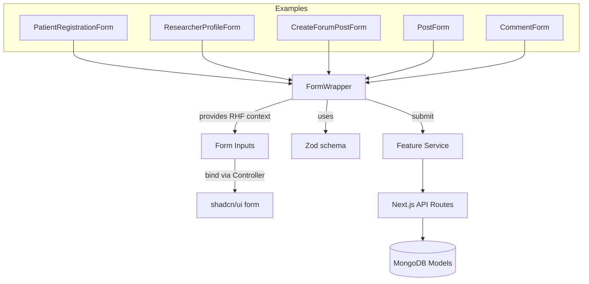
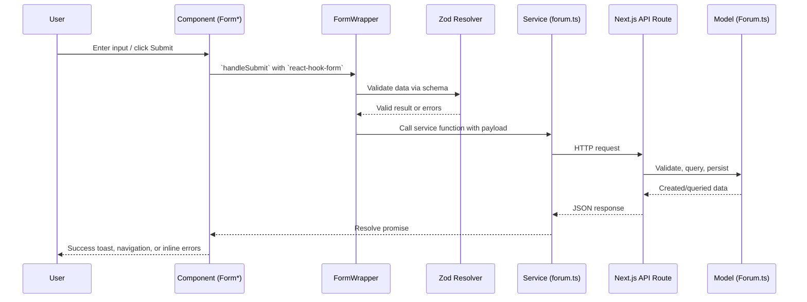

# Forms System Documentation Index

This directory houses comprehensive documentation for the forms system: architecture, reusable components, feature-specific forms, backend integrations, validations, and data models.

## Structure

- `components/` — UI components and feature-specific forms
- `services/` — backend service integrations and API flows
- `validations/` — schemas, rules, and client/server validation
- `models/` — data models backing forms (forum, users, trials)

## Page Hierarchy

- Components
  - `components/FormWrapper.md` — core form architecture and usage
  - `components/PatientRegistrationForm.md`
  - `components/ResearcherProfileForm.md`
  - `components/CreateForumPostForm.md`
  - `components/PostForm.md`
  - `components/CommentForm.md`
- Services
  - `services/ForumService.md` — forum service functions and endpoints
- Validations
  - `validations/ValidationSchemas.md` — user, trial, publication, forum post/comment
- Models
  - `models/ForumModel.md` — forum categories, posts, comments

## Component Connection Diagram

## Data Flow Overview

## How to Use

- Start with `components/FormWrapper.md` to understand architecture and patterns.
- Review feature docs under `components/*` for behavior and props.
- Check `services/ForumService.md` for endpoint contracts and flows.
- See `validations/ValidationSchemas.md` for client/server rules.
- See `models/ForumModel.md` for data shape and relations.

## Cross-References

- `DOCS/FORUM_FORMS.md` — forum-centric flows and endpoints
- `src/app/PROMPT/forums-system.txt` — original product prompts and requirements