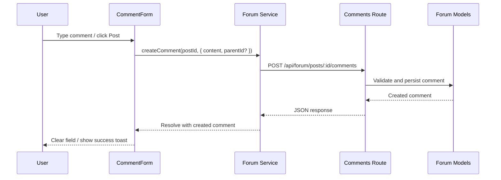

# CommentForm (Forum)

Feature component for writing comments and replies on forum posts.

## Location

- `src/components/forum/CommentForm.tsx`

## Props (high-level)

- `onSubmit(data)` — callback with `{ content, parentId? }`
- `onCancel()` — cancel action
- `placeholder?` — input placeholder
- `initialValue?` — prefill content (edit/reply)

## Behavior

- Uses `react-hook-form` for controlled input
- Supports replying via `parentId` when provided by the parent
- Detects `@username` mentions (UX hint), autocomplete may be integrated
- Disables submit when content empty or while submitting

## API Integration

- Create: `POST /api/forum/posts/:id/comments`
  - Payload: `{ content, parentId? }`
  - Validates post existence and author
- List: `GET /api/forum/posts/:id/comments?limit&offset&sortBy`
  - Supports pagination and sorting

## Data Flow



## Example

```tsx
<CommentForm onSubmit={(data) => createComment(postId, data)} onCancel={() => setReplying(false)} />
```